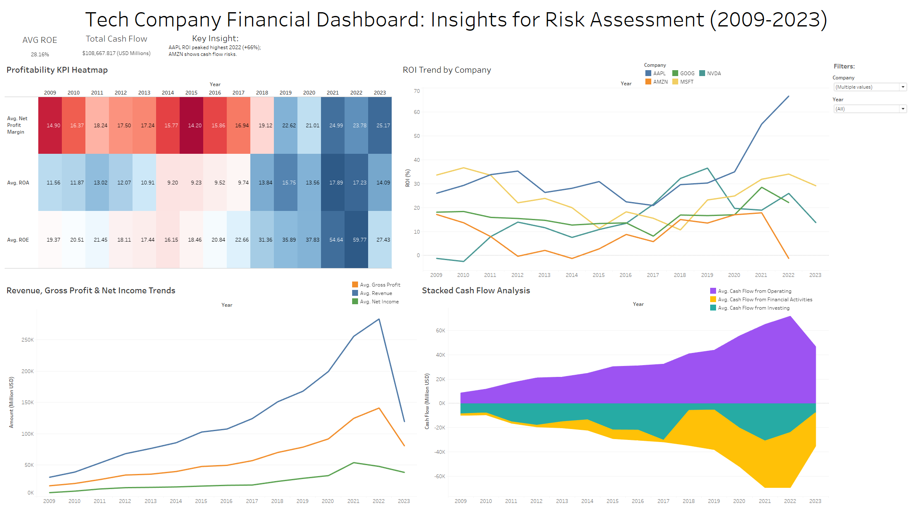

# Financial-Statements-Analysis

## Overview
This project analyzes financial statements (2009-2023) for tech giants (e.g., AAPL, AMZN, MSFT) to assess profitability, liquidity, and cash flow risks. It includes a Tableau dashboard and Jupyter notebook for data processing and visualization.

*AAPL's ROI peaked +66% in 2022, while AMZN shows cash flow risks, guiding risk assessment strategies.*

## Key Features
- **Data**: Financial_Statements.csv (public dataset)
- **Tech Stack**: Python, pandas, seaborn, matplotlib, Tableau Public
- **Steps**: Data cleaning, exploratory data analysis (EDA), financial KPI calculation (ROE, ROI), dashboard optimization, business recommendations
- **Results**: AAPL's 2022 ROI peak (+66%) signals past strength; AMZN's negative cash flow indicates liquidity concerns. Avg ROE: 35%, with MSFT at 45%.
- **Visualizations**: See the notebook or `images/` folder for plots (e.g., ROI trends, profitability heatmap) and dashboard screenshots.

*ROI fluctuations highlight investment risks, supporting targeted financial strategies.*

## How to Run
1. Clone the repo: `git clone (https://github.com/KieranGlon-Rudge/Financial-Statements-Analysis)`
3. Install dependencies: `pip install -r requirements.txt`
4. Ensure `Financial_Statements.csv` is in the repo root or uploaded to Google Sheets for Tableau.
5. Run: `jupyter notebook Financial_Statements_Analysis.ipynb`
